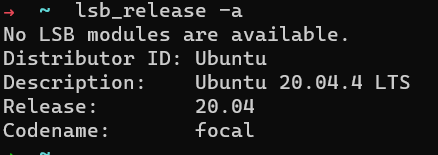
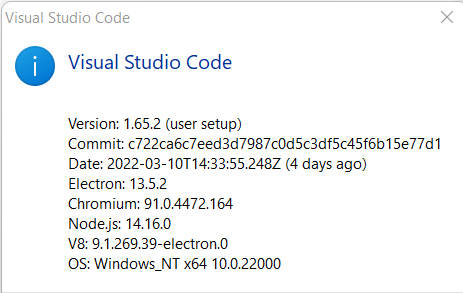

# Face-Mask-Detection
## Given an image with a face of a person, you are expected to build    the model that classifies whether that person is wearing a mask  😷 or not 🙂

## Step for implementation  👍 :
1. collect the dataset for images
2. read the dataset, and set class 0 if the folder that contains images without the mask, and set class 1 if the folder that contains images mask.
3. Preprocessing by Normalization.
4. use ImageDataGenerator
5. use Convolutional Neural Networks (CNN) Sequential model
6. the model takes input images of shape (224, 224, 3) 
7. use compile() method: specifying a loss, metrics, and an optimizer.
8. builds the model and set the number of epochs to equal 30.
9. Get result (precision, recall, f1-score)

## Steps for run the code in ubuntu with Visual Studio Code 👍 :
1. poetry init -n
2. poetry shell
3. poetry add --dev black flack
4. poetry add opencv-python-headless
5. poetry add seaborn
6. poetry add matplotlib
7. poetry add tensorflow
8.poetry add keras
9.poetry add numpy
10.  pip install numpy keras tensorflow matplotlib seaborn opencv-python-headless
11. python mask_detection.py test

###  In [tool.poetry.dependencies] must be change to --> python = ">=3.9,<3.11"

## Version for Python 👍: python = ">=3.9,<3.11"

## Version for ubuntu 👍: 

## Version for Visual Studio Code 👍:

